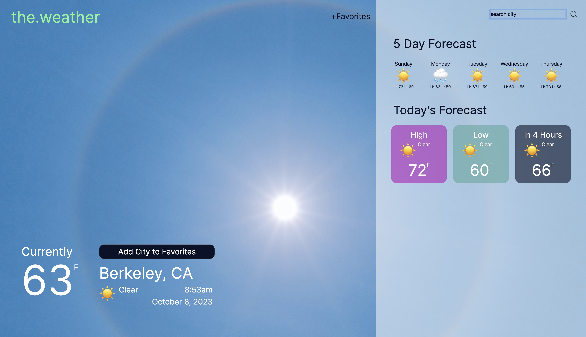

<h1 align="center">The.Weather</h1>

<a href="https://theweatherrr.vercel.app/" target="_blank">**The.Weather**</a> is a fully functional desktop Weather App that pulls data from the <a href="https://openweathermap.org/api" target="_blank">OpenWeatherMapAPI</a>. It shows the current weather info as well as future forecasts for the current day and week.

## Features

- Search field auto-populates suggested city names
- Background adapts to changes in the weather (e.g. Sunny, Rainy, Snowy)
- Fully functional favorites list implemented via local storage
- Highs/Lows are calculated via iterating over all available data to ensure accuracy

## Preview

## Notes
  
Results favor US cities but international codes are supported. For example, searching for 'Paris' outputs the result for Paris, Texas but searching for 'Paris, FR' will get you Paris, France  
  
Some more examples:  
Lodi --> Lodi, California  
Lodi, IT --> Lodi, Italy  
Madrid --> Madrid, Iowa  
Madrid, ES --> Madrid, Spain  
  
If no suitable US City is found, the top international result will be shown. For example 'Beijing' results in Beijing, China without needing the country code  
  
Some examples:  
Nairobi -- > Nairobi, Kenya  
London --> London, Great Britain  
Amsterdam --> Amsterdam, Netherlands  
